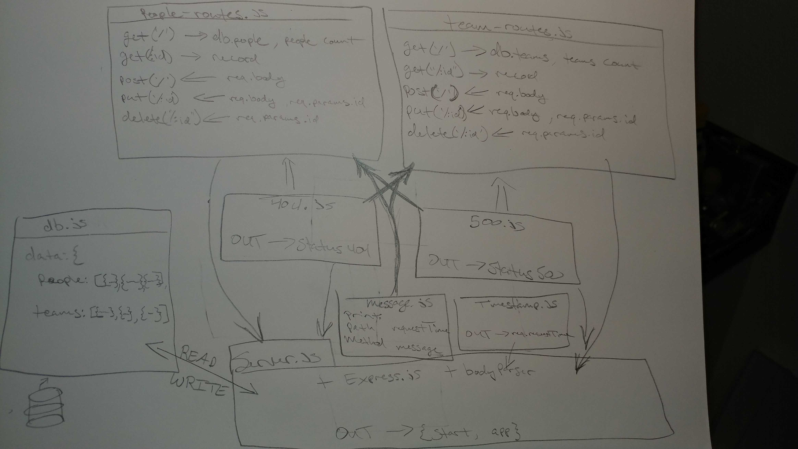

# LAB - 07

## Express

### Author: James Dunn

### Links and Resources

- [submission PR](https://github.com/james-401-advanced-javascript/lab-07/pull/1)
- [travis](https://travis-ci.com/james-401-advanced-javascript/lab-07)
- [front-end](https://jamesdunn-lab-07.herokuapp.com)

#### Documentation

- [jsdoc](https://jamesdunn-lab-07.herokuapp.com/docs)

### Modules

#### `people-routes.js`

#### `team-routes.js`

#### `timestamp.js`

#### `message.js`

#### `404.js`

#### `500.js`

##### Exported Values and Methods

###### `getAll(object)`

###### `getPerson(object)`

###### `createPerson(object)`

###### `updatePerson(object)`

###### `updatePerson(object`

###### `deletePerson(object)`

### Setup

#### `.env` requirements

- `PORT` - 3000

#### Running the app

- `npm start`
- Endpoint: `server.js`

#### Tests

- How do you run tests?
- `npm test`

#### UML

